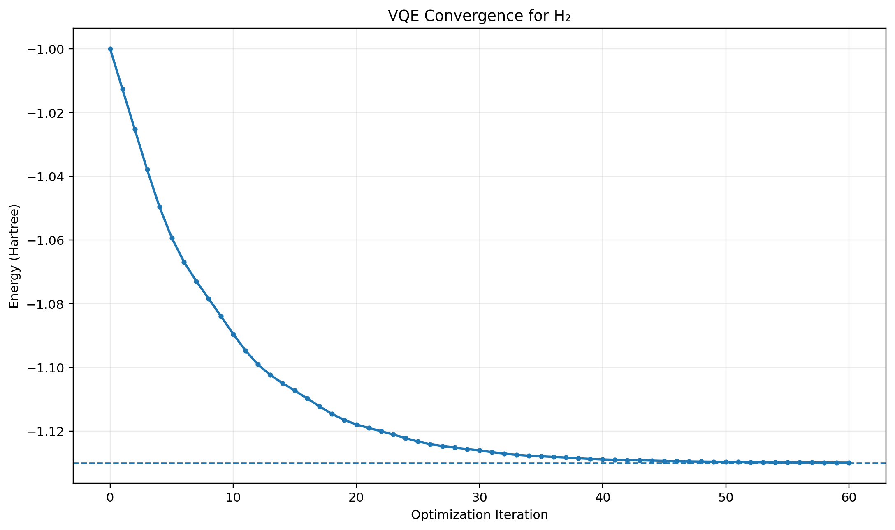

# Ab Initio VQE Molecular Chemistry for H2 using PennyLane




This project demonstrates an **ab initio Variational Quantum Eigensolver (VQE)** workflow for the hydrogen molecule **H₂** using **PennyLane** and the **STO-3G** basis.

The project covers molecular Hamiltonian construction, Hartree–Fock state preparation, excitation-based ansatz design, VQE optimization, exact diagonalization reference, bond-length scanning, and error analysis.

## Project Highlights

- Molecule: H₂
- Method: Ab Initio VQE
- Framework: PennyLane
- Basis set: STO-3G
- Hartree–Fock initial state
- Single and double excitations
- Variational quantum eigensolver
- Exact diagonalization reference
- Bond-length scan
- Potential energy curve
- VQE convergence analysis
- Absolute error analysis

## Main Results

- Optimal bond length: **0.7364 Å**
- Reference bond length: **0.7414 Å**
- Minimum VQE energy: **-1.127951287 Ha**
- Exact energy at minimum: **-1.137304145 Ha**
- Absolute error at minimum: **0.0093528581 Ha**

### Single-Point VQE Result

- VQE ground-state energy: **-1.1372700833 Ha**
- Exact ground-state energy: **-1.1372701755 Ha**
- Absolute error: **9.2172e-8 Ha**

## Files

- `ab_initio_vqe.py` — single-point ab initio VQE calculation
- `ab_initio_bond_scan.py` — bond-length scan and potential energy analysis
- `export_results.py` — exports project results to JSON
- `vqe_results.json` — exported numerical results
- `requirements.txt` — Python dependencies

## Technologies

- Python
- PennyLane
- NumPy
- SciPy
- Matplotlib
- Variational Quantum Algorithms
- Quantum Chemistry

## Objective

The goal of this project is to demonstrate how hybrid quantum-classical algorithms can be applied to molecular electronic-structure problems using a reproducible VQE workflow.

## Status

**Completed**


## How to run

pip install -r requirements.txt
python vqe_h2.py

## Run locally

```bash
git clone https://github.com/Tamas22-cell/ab-initio-vqe-molecular-chemistry-for-h2-using-pennylane.git
cd ab-initio-vqe-molecular-chemistry-for-h2-using-pennylane

pip install -r requirements.txt

python vqe_h2.py
